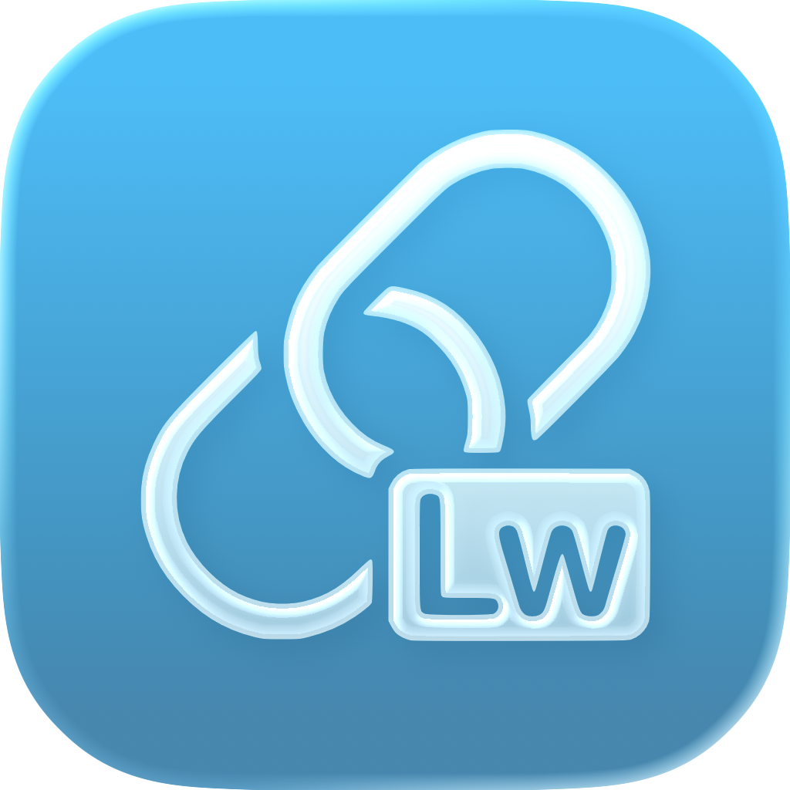

  
  <h1>My Links</h1>

  My Links is a <b><a href="https://github.com/linkwarden/linkwarden">Linkwarden</a></b> client for iOS and macOS. It has been built with SwiftUI, the official framework provided by Apple to build applications for their operating systems, focusing mainly on obtaining good performance and an UI that follows Apple's design guidelines.

 

  

 
<h2>Donate</h2>
If you like my work and you want to support it, consider giving me a tip.

 

 
 
 
 
<b>Created by JGeek00</b>